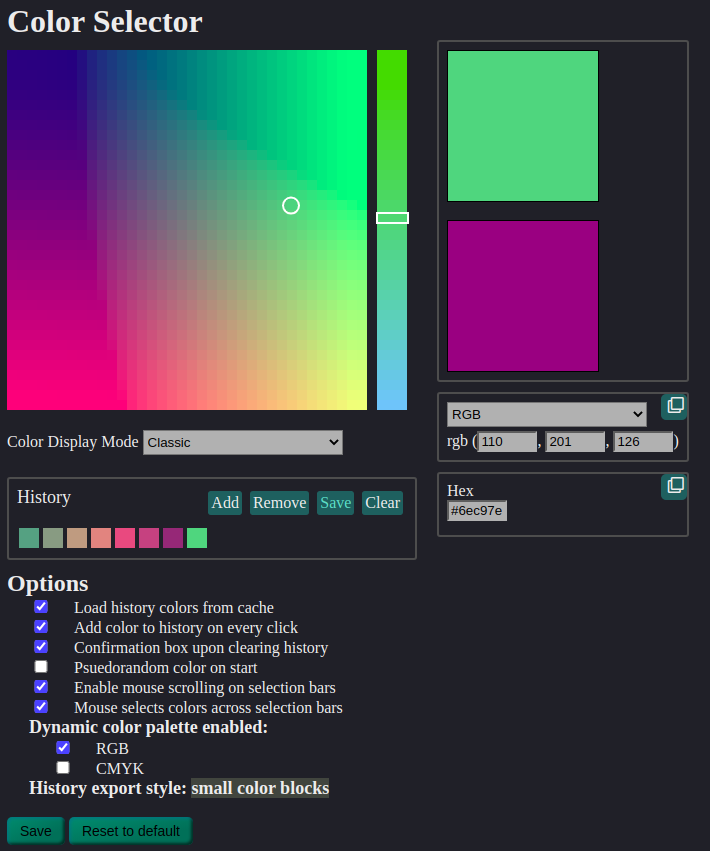

# color-picker v1.0
`color-picker` is a tool made for picking and exporting colors. Convenient functions are built into this program to facilitate use such as support for inputting and copying colors via hexadecimal etc, and the history tracking section manages your color palette and can be cached or exported. This can be hosted locally by a server on the local network to be accessed from the browser.

The recommended way to use this tool is simply download one of the executables for your platform, eg. color_picker-linux, run it from the command line or wherever, and the tool will be accessible from `localhost:3030`.

Screenshot of the UI
-------------------------------

